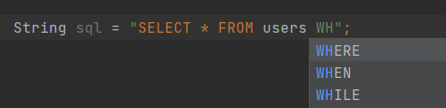
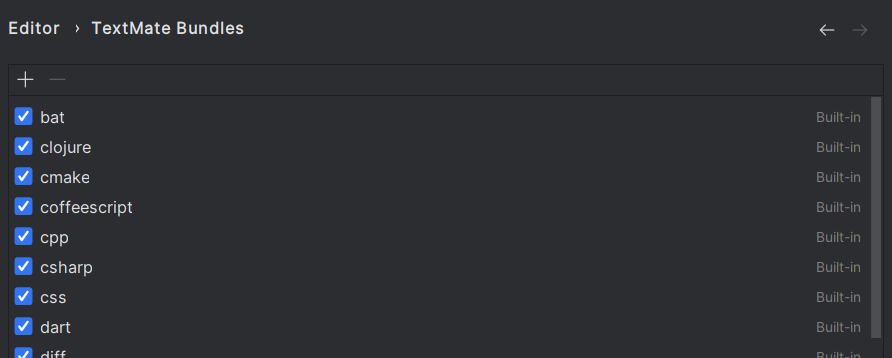

# Injected language in IDEA CE

# Contents

- [Contents](#contents)
    - [Short description](#short-description)
    - [Install plugin](#install-plugin)
    - [Usage](#usage)
    - [Features](#features)
    - [Bugs](#bugs)

## Short description

Plugin for language injection. Provides language injection in string literals. The injected languages can be those for
which [TextMate Bundles](https://www.jetbrains.com/help/webstorm/tutorial-using-textmate-bundles.html) are available.

## Requirements

| IDE                             | min version | max version | status                |
|---------------------------------|-------------|-------------|-----------------------|
| IntelliJ IDEA Community Edition | 2022.2      | 2023.1.5    | supported             |
| IntelliJ IDEA Community Edition | 2023.2      | 2023.2      | currently unsupported |
| IntelliJ IDEA Ultimate          | 2022.2      | 2023.1.5    | supported             |
| CLion                           | 2022.2      | 2023.1      | supported             |
| PyCharm Professional Edition    | 2022.2      | 2023.1.4    | supported             |
| PyCharm Community Edition       | 2022.2      | 2023.1      | supported             |
| PhpStorm                        | 2022.2      | 2023.1      | supported             |
| Rider                           | 2022.2.4    | 2023.1.4    | supported             |
| GoLang                          | 2022.2.6    | 2023.1.4    | supported             |
| RubyMine                        | -           | -           | -                     |

Supported languages: `Java`, `Kotlin`, `python`, `C++`, `PHP`, `TypeScript`, `C#`, `Go`

## Install plugin

1. Go to the [Releases](https://github.com/SuduIDE/ij-textmate) section
2. Select the assets you are interested in
3. Download `ij-textmate-*.jar` file. `*` - any string
4. Open `intellij IDEA`
5. Press `Ctrl+Alt+S` to open the IDE settings and select Plugins
6. Select the `Plugins` tab
7. Click on the gears to the right of the `Installed` button and then click `Install Plugin from Disk…`
8. Select the plugin archive file and click `OK`
9. Click OK to apply the changes and restart the IDE if prompted

## Usage

1. Select the string literal in which we want to embed the language. To do this, move the caret to a position inside the
   string literal

   

2. First press `Ctrl+\` then press `Ctrl+I`. A list of possible injection languages will appear. Use the keys to
   navigate through the list:
    - `↑` - move up
    - `↓` - move down

   
3. Press `enter` to confirm your choice

   

4. To remove an injection, first press `Ctrl+\` then press `Ctrl+I`

## Features

- You can also search by name when selecting languages. To do this, just type the name of the language you need

  

- Support completion for injected language

  

- Injections are saved when the IDE is restarted

- The list of supported languages depends on the mappings loaded by Textmate Bundles

  

## Bugs

- Injected language locale in string literals with references only works for `java`.

- Error occurs during initialization `PersistentStateComponent` in all ide except Intellij.
