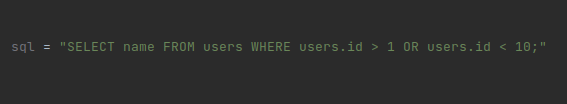
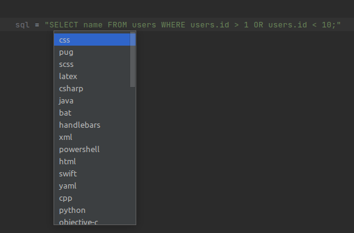
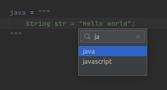

# Injected language in IDEA CE

# Contents

- [Contents](#contents)
  - [Short description](#short-description)
  - [Install plugin](#install-plugin)
  - [Usage](#usage)

## Short description

Plugin for language injection. Provides language injection in string literals. The injected languages can be those for which [TextMate Bundles](https://www.jetbrains.com/help/webstorm/tutorial-using-textmate-bundles.html) are available.

## Install plugin

1. Go to [github](https://github.com/SuduIDE/ij-textmate)
2. Go to the `Releases` section
3. Select the assets you are interested in
4. Download `ij-textmate-*.jar` file. `*` - any string
5. Open `intellij IDEA`
6. Press `Ctrl+Alt+S` to open the IDE settings and select Plugins
7. Select the `Plugins` tab
8. Click on the gears to the right of the `Installed` button and then click `Install Plugin from Disk…`
9. Select the plugin archive file and click `OK`
10. Click OK to apply the changes and restart the IDE if prompted

## Usage

1. Select the string literal in which we want to embed the language. To do this, move the caret to a position inside the
   string literal

   

2. First press `Ctrl+\` then press `Ctrl+I`. A list of possible injection languages will appear. Use the keys to
   navigate through the list:
    - `↑` - move up
    - `↓` - move down

   
3. Press `enter` to confirm your choice

   

4. To remove an injection, first press `Ctrl+\` then press `Ctrl+I`

You can also search by name when selecting languages. To do this, just type the name of the language you need.

