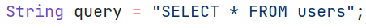

# Injected language in IDEA CE

# Contents

- [Contents](#contents)
- [Terms and motivation](#terms-and-motivation)
- [Short description](#short-description)
- [Install plugin](#install-plugin)
- [Usage](#usage)
- [Features](#features)
- [Bugs](#bugs)

## Terms and motivation

Sometimes a person who deals with code has to write code fragments in another language inside string literals.

For example `SQL` queries inside `Java` string literals:

This is where `language injections` help. They allow you to add `syntax highlighting` and `code completion` inside
string literals.

The language injection plugin is called `IntelliLang`. However, in the `intellij idea community edition`, many languages
are missing, such as `SQL`. But there are `TextMate Bundles`. With which you can get `syntax highlighting`. This can be
done as follows:
<table>
  <tr>
    <td>
        
        
    </td>
    <td> There is a string literal </td>
  </tr>
  <tr>
    <td>
        
        
    </td>
    <td> Add a "language=textmate" comment above the string literal </td>
  </tr>
  <tr>
    <td>
        
        
    </td>
    <td> Replace "textmate" with "sql" </td>
  </tr>
</table>

---
**NOTE**

The described method does not work in IDEs version 2023.2

---

In this `syntax highlighting` solution, the plan is to:
- use `TextMate Bundles`
- provide injection recovery on IDE startup
- perform `syntax highlighting` without using comments. To be able to inject a language where you can't use comments. For example, to inject `JS` into `HTML`
- add `code completion`
- ensure that the injection can be performed in any language

## Short description

Plugin for language injection. Provides language injection in string literals. The injected languages can be those for
which [TextMate Bundles](https://www.jetbrains.com/help/webstorm/tutorial-using-textmate-bundles.html) are available.

## Requirements

| IDE                             | min version | max version | status                |
|---------------------------------|-------------|-------------|-----------------------|
| IntelliJ IDEA Community Edition | 2022.2      | 2023.1.5    | supported             |
| IntelliJ IDEA Community Edition | 2023.2      | 2023.2      | currently unsupported |
| IntelliJ IDEA Ultimate          | 2022.2      | 2023.1.5    | supported             |
| CLion                           | 2022.2      | 2023.1      | supported             |
| PyCharm Professional Edition    | 2022.2      | 2023.1.4    | supported             |
| PyCharm Community Edition       | 2022.2      | 2023.1      | supported             |
| PhpStorm                        | 2022.2      | 2023.1      | supported             |
| Rider                           | 2022.2.4    | 2023.1.4    | supported             |
| GoLang                          | 2022.2.6    | 2023.1.4    | supported             |
| RubyMine                        | 2022.2.5    | 2023.1.5    | supported             |

Supported languages: `Java`, `Kotlin`, `python`, `C++`, `PHP`, `TypeScript`, `C#`, `Go`, `Ruby`

## Install plugin

1. Go to the [Releases](https://github.com/SuduIDE/ij-textmate) section
2. Select the assets you are interested in
3. Download `ij-textmate-*.jar` file. `*` - any string
4. Open `intellij IDEA`
5. Press `Ctrl+Alt+S` to open the IDE settings and select Plugins
6. Select the `Plugins` tab
7. Click on the gears to the right of the `Installed` button and then click `Install Plugin from Disk…`
8. Select the plugin archive file and click `OK`
9. Click OK to apply the changes and restart the IDE if prompted

## Usage

1. Select the string literal in which we want to embed the language. To do this, move the caret to a position inside the
   string literal

   

2. First press `Ctrl+\` then press `Ctrl+I`. A list of possible injection languages will appear. Use the keys to
   navigate through the list:
    - `↑` - move up
    - `↓` - move down

   
3. Press `enter` to confirm your choice

   

4. To remove an injection, first press `Ctrl+\` then press `Ctrl+I`

## Features

- You can also search by name when selecting languages. To do this, just type the name of the language you need

  

- Support completion for injected language

  

- Injections are saved when the IDE is restarted

- The list of supported languages depends on the mappings loaded by Textmate Bundles

  

## Bugs

- Injected language locale in string literals with references only works for `java`.

- Error occurs during initialization `PersistentStateComponent` in all ide except Intellij.
